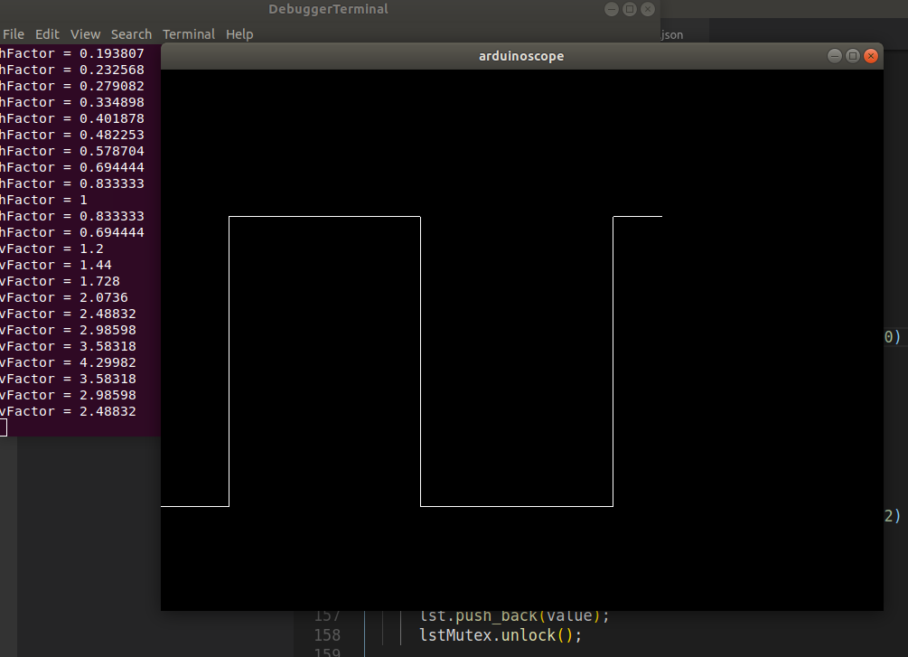
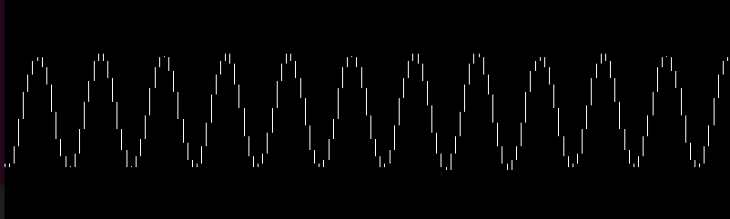
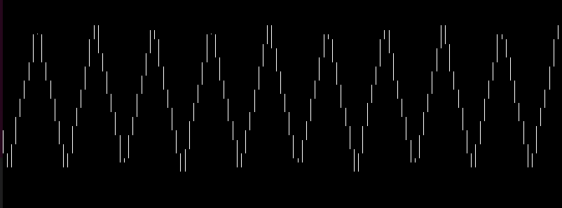
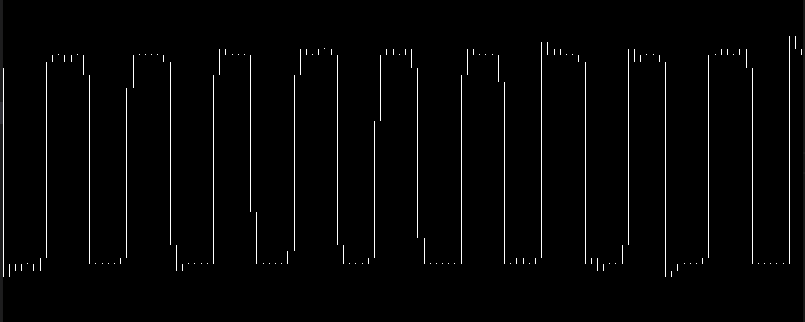
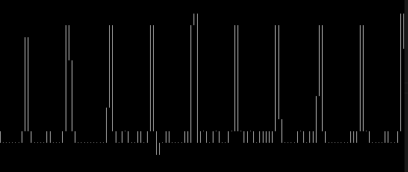
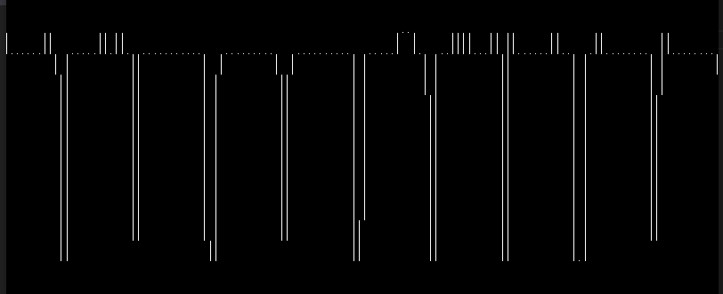

# arduino-scope
simple oscilloscope opengl using arduino as adc input through usb serial


*scoping f-Generator 9Hz from Transistor Tester*

## introduction

Reading about [audio signal acquisition from a headphone jack](http://forum.arduino.cc/index.php?topic=42833.0) I wanted to try to see if suggested experiment works:
- connect headphone through a simple resistors, capacitors [circuit](http://interface.khm.de/index.php/lab/interfaces-advanced/arduino-realtime-audio-processing/) from Android to Arduino
- using [Keuwisoft Dual Channel Function Generator](https://play.google.com/store/apps/details?id=com.keuwl.functiongenerator)
- using Arduino ADC to convert signal to digital, then serial
- using C++ opengl program to display waveform

## keys

- *space* : pause display
- *v/V* : decrease/increase vertical factor
- *h/H* : decrease/increase horizontal factor
- *up/down* : delta vertical

## flash arduino

- pre: install [arduino ide](https://www.arduino.cc/en/Main/Software)
- open sketch `arduino-scope/arduino-scope.ino` and flash firmware
  - tools/board ( eg. arduino nano )
  - tools/port
  - sketch upload

## debug and execution

- pre: install [vscode](https://code.visualstudio.com/) and suggested c++ extension asked when open the folder

```
code .
```

- breakpoints works thanks to `gdb` debugger ( `-g` switch to gcc - see Makefile )
- hit F5 to start

## dev notes

- data 10bit adc from arduino are encoded into two bytes with a marker to allow c++ to recognize binary data order ( see word [mangled](https://github.com/devel0/arduino-scope/blob/3fe14ac2e20721e855c94ae7a256e31a1498df7d/arduino-scope/arduino-scope.ino#L27-L39) and [demangle](https://github.com/devel0/arduino-scope/blob/3fe14ac2e20721e855c94ae7a256e31a1498df7d/arduinoscope.cc#L152)

## function generator through smartphone

- 440Hz





- 440Hz duty 10%, 90%




- 1Khz


## future

Show signal informations such as:
- min,max,mean Voltage value
- signal frequency
- ...
