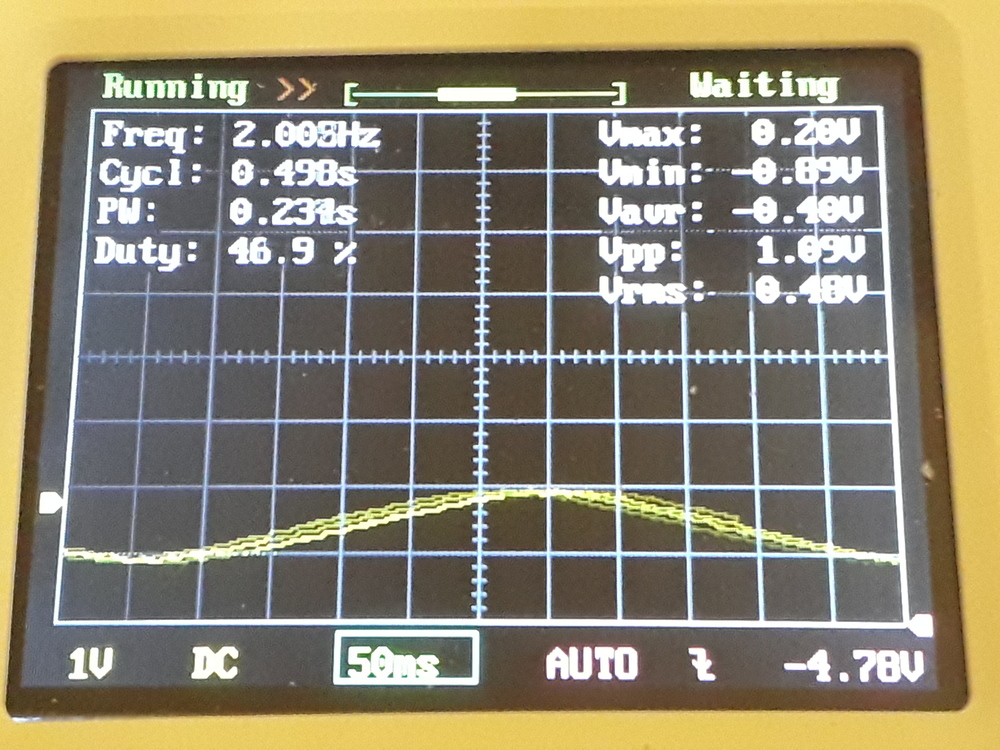
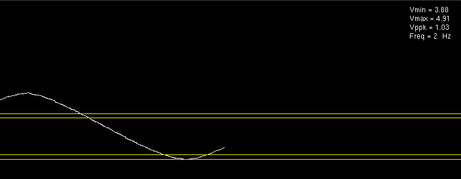
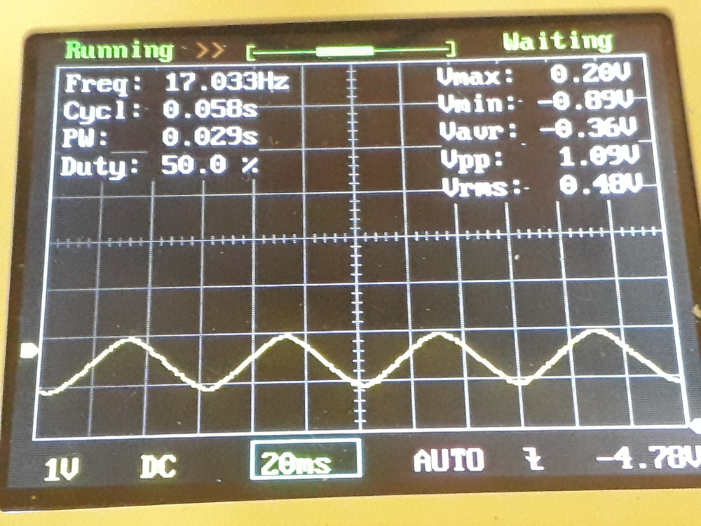
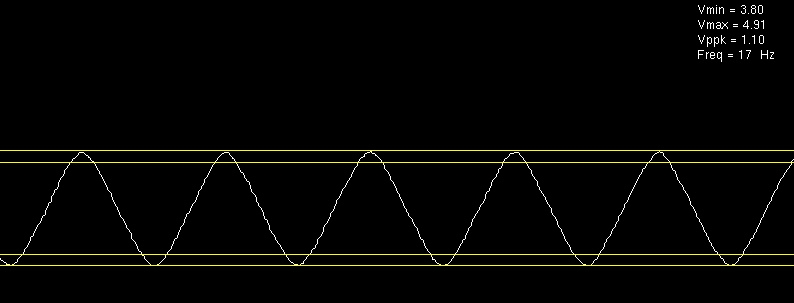
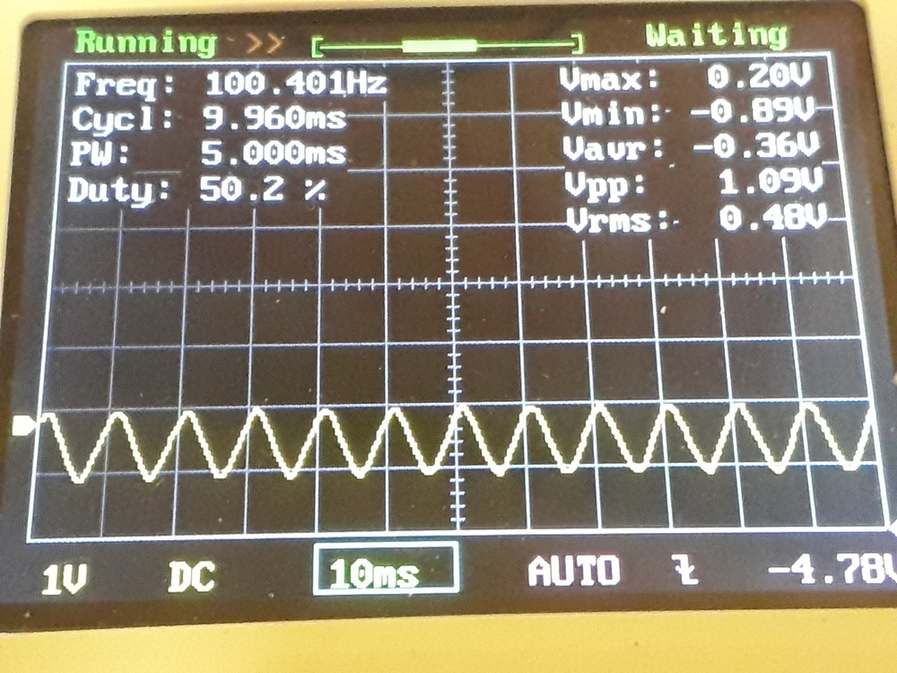
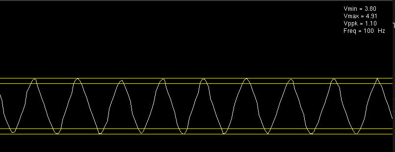
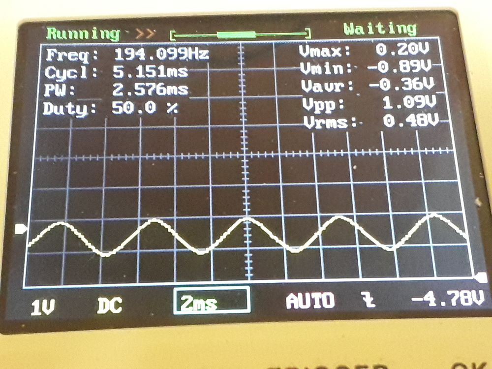
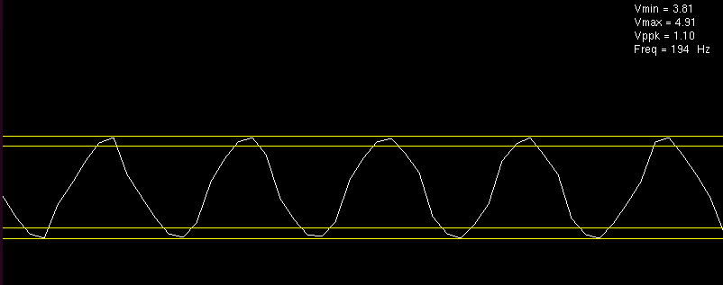

# arduino-scope
simple oscilloscope opengl using arduino as adc input through usb serial

- Arduino ADC to convert signal to digital, then serial
- C++ opengl program to display waveform

## keys

- *space* : pause display
- *v/V* : decrease/increase vertical factor
- *h/H* : decrease/increase horizontal factor
- *up/down* : delta vertical
- *p* : toggle point mode
- *t* : toggle text info

## flash arduino

- pre: install [arduino ide](https://www.arduino.cc/en/Main/Software)
- open sketch `arduino-scope/arduino-scope.ino` and flash firmware
  - tools/board ( eg. arduino nano )
  - tools/port
  - sketch upload

## debug and execution

- pre: install [vscode](https://code.visualstudio.com/) and suggested c++ extension asked when open the folder

```
code .
```

- breakpoints works thanks to `gdb` debugger ( `-g` switch to gcc - see Makefile )
- hit F5 to start

## dev notes

- serial setup in c++ app is buggy ( a workaround is to start serial log from arduino then close after flashed )

## comparision

using 10bit adc and serial output I was able to detect [frequency count](https://github.com/devel0/arduino-scope/blob/6be14c5f0db8fd69c381b6d43ea400d43530e45f/SignalStat.cc#L47-L65) up to 200Hz and Vppk with good resolution. Note: to condition the offset of a signal generator (centered in 0V) I used a voltage divider on the adc input

### 2hz




### 17hz




### 100hz




### 194hz



