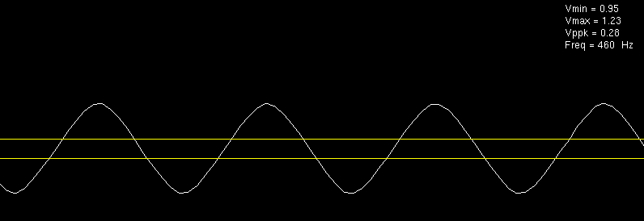
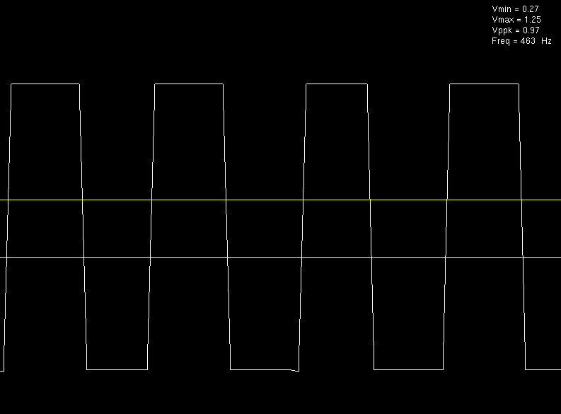
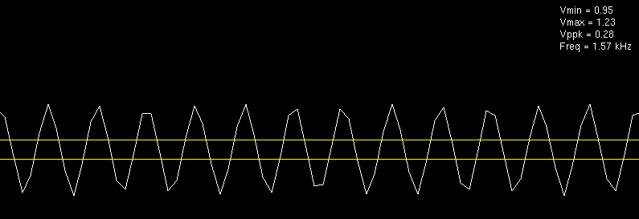
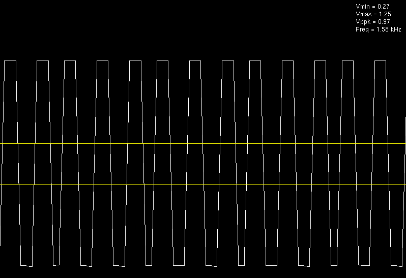
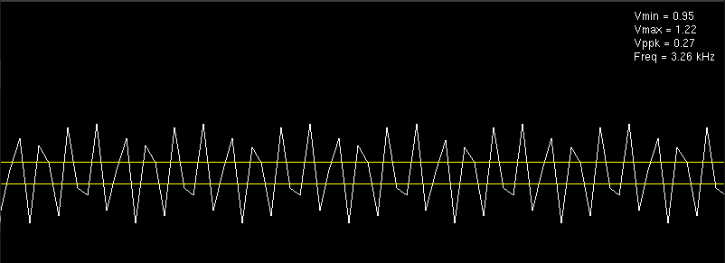
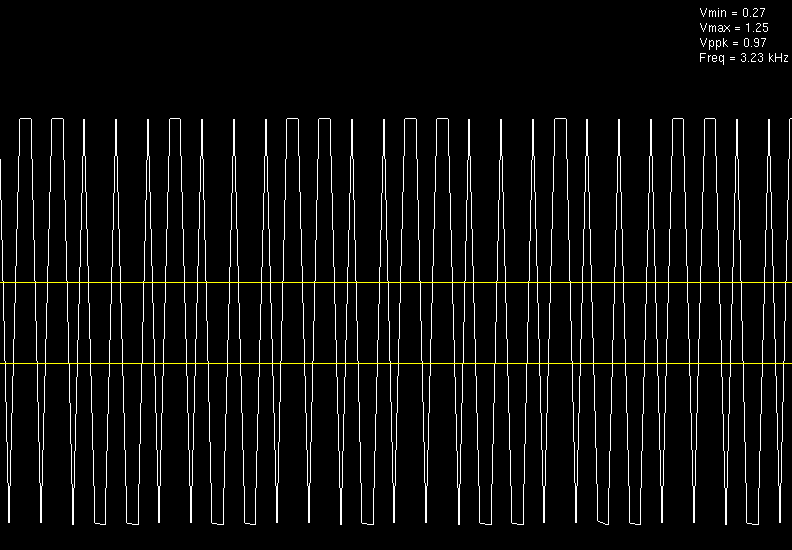
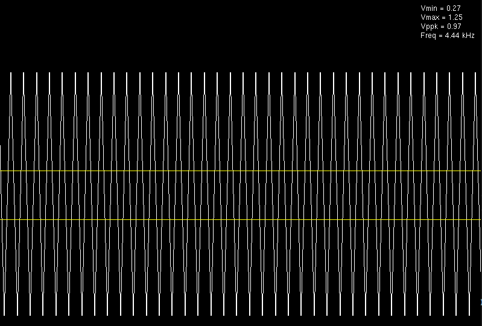

# arduino-scope
simple oscilloscope opengl using arduino as adc input through usb serial

- Arduino ADC to convert signal to digital, then serial
  - 115kbaud =~ 11.5kb/s ( need at least 2 byte for a freq detect, ie. max freq detectable about 11.5khz/2 )
- C++ opengl program to display waveform

## keys

- *space* : pause display
- *v/V* : decrease/increase vertical factor
- *h/H* : decrease/increase horizontal factor
- *up/down* : delta vertical
- *p* : toggle point mode
- *t* : toggle text info

## flash arduino

- pre: install [arduino ide](https://www.arduino.cc/en/Main/Software)
- open sketch `arduino-scope/arduino-scope.ino` and flash firmware
  - tools/board ( eg. arduino nano )
  - tools/port
  - sketch upload

## debug and execution

- pre: install [vscode](https://code.visualstudio.com/) and suggested c++ extension asked when open the folder

```
code .
```

- breakpoints works thanks to `gdb` debugger ( `-g` switch to gcc - see Makefile )
- tune serial port in `launch.json` "args"
- hit F5 to start

## dev notes

- serial setup in c++ app is buggy ( a workaround is to start serial log from arduino then close after flashed )

## comparision

| freq | sine | square |
|---|---|---|
| 460hz |  |  |
| 1.57khz |  |  |
| 3.26khz |  |  |
| 4.44khz | N/A |  |
